# Tigard 使用手册

## 简介

本分支Tigard添加了中文的说明书，以及部分软件和脚本。
Tigard 是一款基于 **FT2232 芯片** 的多功能调试器，具备以下特点：

- 支持多种通讯方式：**串口、JTAG、SPI、I2C、SWD** 等
- 兼容多种电平标准：**1.8V、3.3V、5V** 以及待检测设备自身的通讯电平
- 适用场景：调试器、串口工具、逆向工程、芯片调试

> **官方资源**  
> GitHub: [https://github.com/tigard-tools/tigard](https://github.com/tigard-tools/tigard)  
> 视频教程: [Bilibili](https://www.bilibili.com/video/BV11A37zeEAP)

---

## 一、理解 FT2232 芯片

要真正理解 Tigard 的工作原理，必须先了解 **FT2232** 芯片。掌握了它，你就能理解市面上大部分烧录器的工作原理。

### FT 系列芯片命名规律

| 芯片 | 含义 |
|------|------|
| FT232 | 1 个串口（232 代表 RS232 标准） |
| FT2232 | 2 组串口 |
| FT4232 | 4 组串口 |

### 工作原理

- FT232 相当于一个**不可编程的单片机**
- 启动时会检查外部 EEPROM，读取配置并按照配置工作
- FT2232 带有两组总线：**ADBUS** 和 **BDBUS**，功能完全相同
- 通过配置，可将总线设为不同接口：串口、JTAG 等
- **短接 TDI 和 TDO** 即可得到 SWD 接口
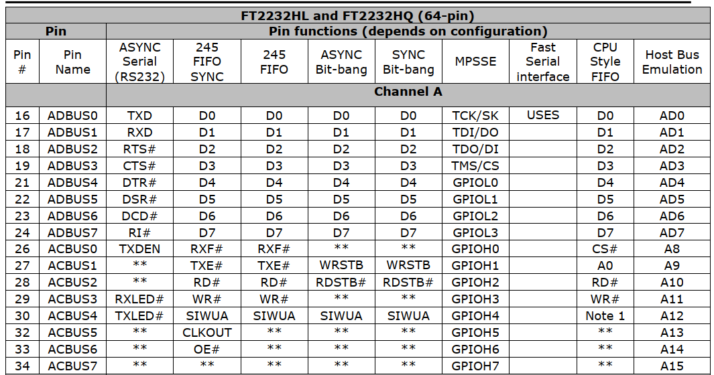

### 优势

将 ADBUS 设为**串口**、BDBUS 设为 **JTAG**，即可获得一套完善的调试方案：
- 串口用于接收日志
- JTAG 用于烧录和调试
---

## 二、Tigard 硬件设计

### 电平转换

FT2232 仅支持 **3.3V** 外部电压。为保证兼容性并保护芯片，Tigard 使用了 **74HC245 电平转换芯片**，通过开关控制转换侧电压，以适配不同设备。

### 模式切换开关

板载开关用于在 **SWD / JTAG** 之间切换，同时也影响 I2C 和 SPI。其原理是短接 BDBUS1 和 BDBUS2。

### JTAG 与 SPI 的相似性

| JTAG | SPI | 方向 |
|------|-----|------|
| TDO | MOSI | 输出 |
| TDI | MISO | 输入 |
| TCK | SCK | 时钟 |
| TMS | CS | 输出 |

> 有趣的是：JTAG 和 SPI 都是 **输入量 = 输出量** 的协议。可以用 JTAG 模拟 SPI 总线。

### SWD 模拟

- SWCLK → TCK（时钟）
- SWDIO → TDO + TDI（双向）
- 短接设备上的 SWDIO 到 TDI 和 TDO 即可

### I2C 模拟

| I2C | SWD |
|-----|-----|
| SDA | SWDIO |
| SCL | SWCLK |

> ⚠️ 注意：I2C 引脚是**开漏**结构，需要上拉电阻；SWD 不需要。两者仅在“形式上”相似，协议差异很大。

---

## 三、连接电脑

将 Tigard 接入电脑后，设备管理器中会出现 **三个新增设备**：

| 设备 | 说明 |
|------|------|
| USB Serial Port | 标准串口（含 DCD、DSR、DTR、CTS、RTS） |
| USB Serial Converter A | 与上述串口本质相同 |
| USB Serial Converter B | JTAG 接口（此接口是被设置为MPSSE模式，不会被分配串口号） |
---
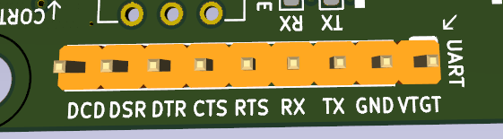
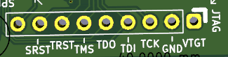

## 四、串口功能

Tigard 的串口引出为 **9-pin 接口**，包含 DTR 等信号（廉价工具常省略）。DTR 常被用作单片机复位信号。

- **最高波特率**：12 Mbit
- **优点**：免驱、误码率低、使用体验极佳
- **结论**：需要稳定耐用的串口芯片，首选 FT 系列


---

## 五、JTAG 兼容性

FT2232 的 JTAG 接口久经考验。Tigard 的 JTAG 兼容性极佳，已成功连接：

- FPGA
- AVR 单片机
- 博通芯片

> 基本上，该接口对任意 JTAG 设备都管用。

---

## 六、Top JTAG Probe（TJP）使用教程

> 这是一款 **JTAG 逆向软件**，官网：[http://www.topjtag.com/probe/](http://www.topjtag.com/probe/)  
> 非免费，但有试用期。JTAG 最初用于边界扫描，后续扩展出烧录等功能，该软件利用该特性，直接调用芯片的ic位置。
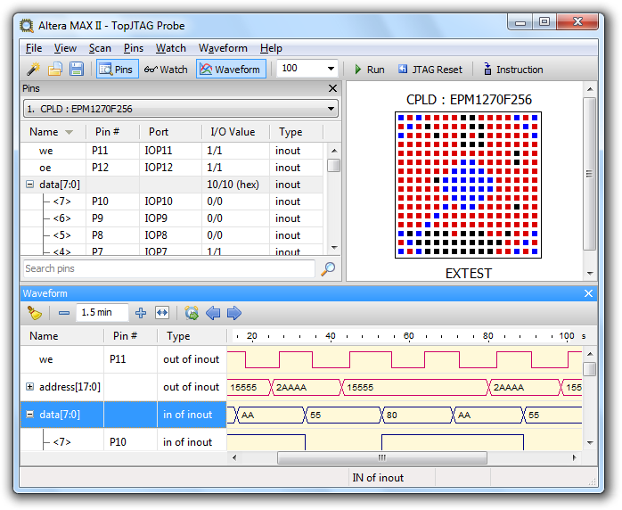

### 示例硬件

使用 **Arduino Leonardo**，通过 USBasp 烧录器修改熔丝位，开启 JTAG 接口。
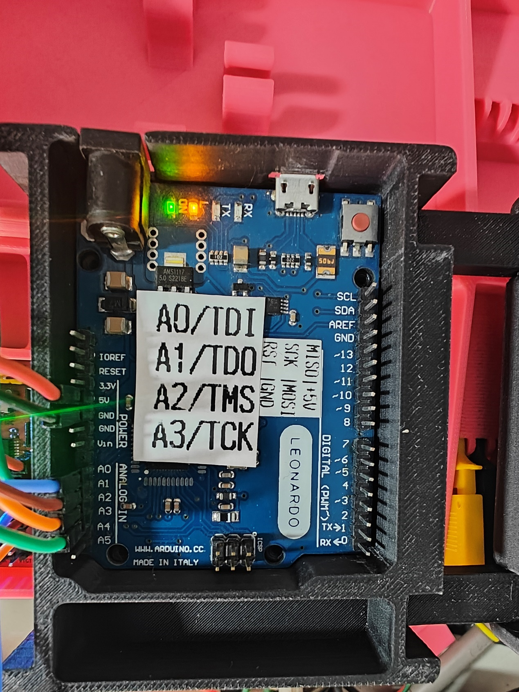

> ⚠️ 注意：AVR 的 JTAG 接口在 ADC 引脚上，开启后 ADC 功能不可用。

### 操作步骤

#### 1. 新建项目
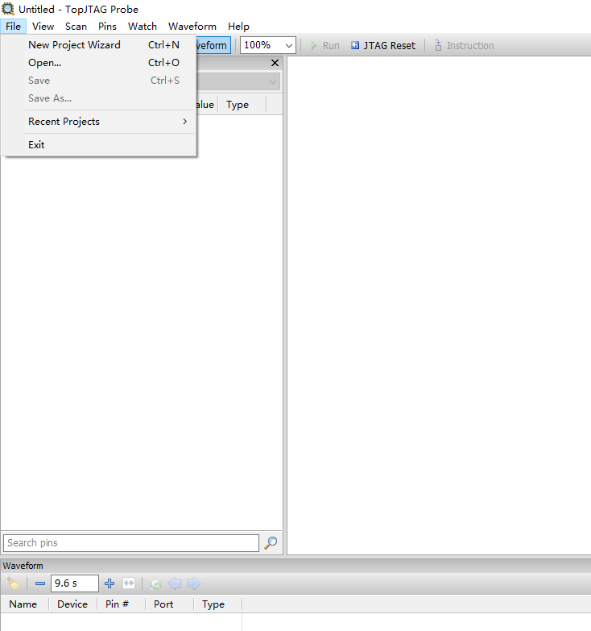

#### 2. 配置参数

| 参数 | 设置 |
|------|------|
| Connection | Generic FTDI FT2232 |
| Device | 选靠下的选项（A 口为串口，B 口为 JTAG） |
| Static Pins | Olimex ARM-USB-OCD |
| JTAG 速度 | 从低到高测试，最高 30M |
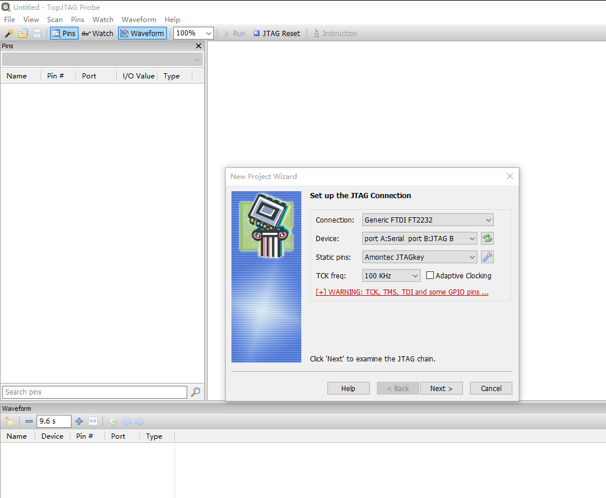

#### 3. 识别芯片

点击 Next，若能正常识别，可返回上一步提高速度。

示例识别结果：Atmel 芯片，ID CODE = `4958703Fh`
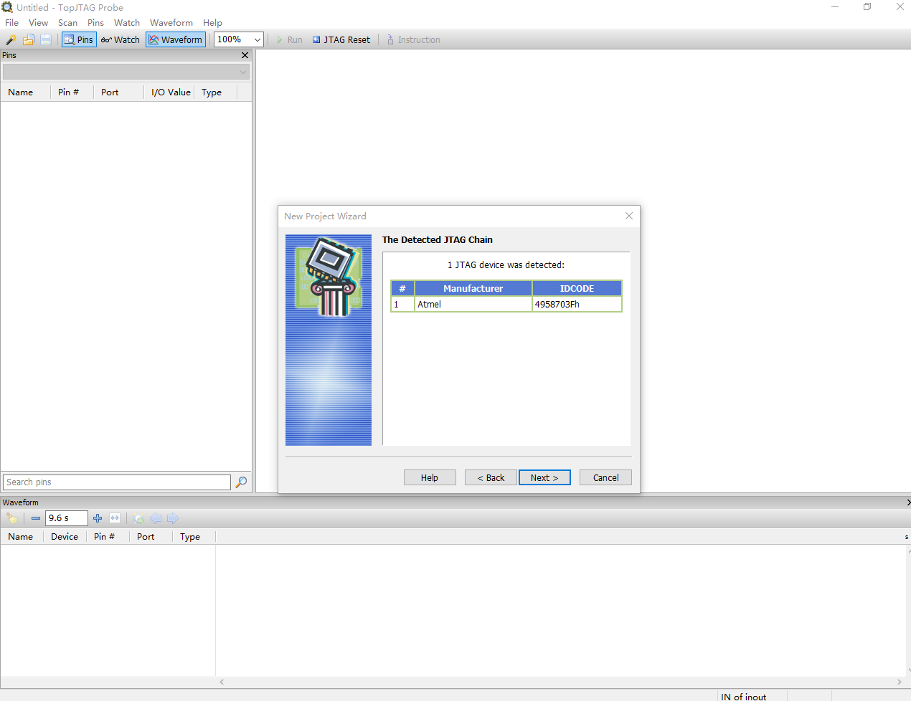

#### 4. 加载 BSDL 文件

- 推荐下载网站：[https://www.bsdl.info/index.htm](https://www.bsdl.info/index.htm)
- 根据 ID CODE 搜索并下载对应 BSDL 文件
- 点击 **BDSL File** 导入，再按实际封装设置 Package
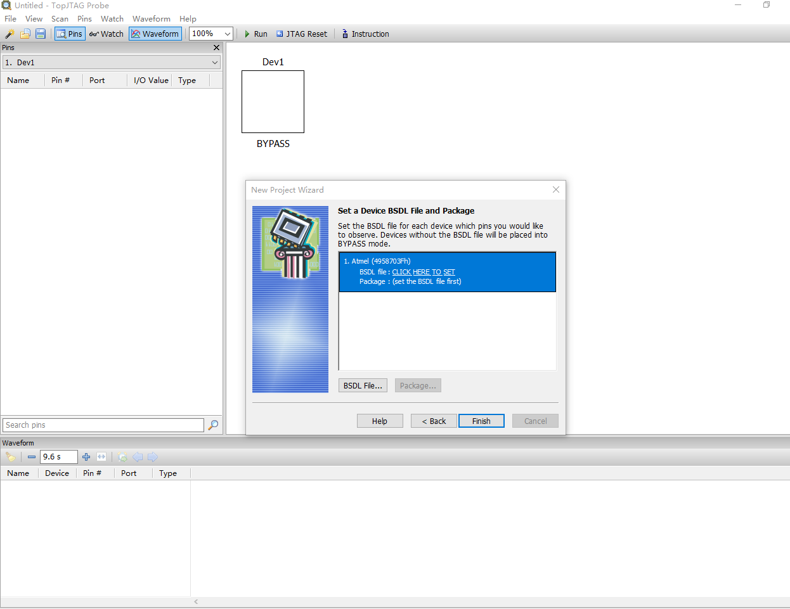
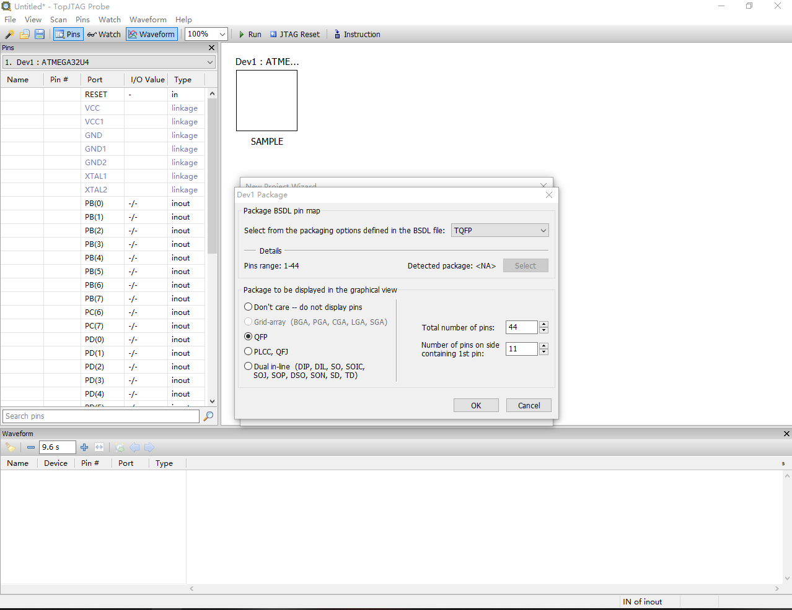
> BSDL = Boundary Scan Description Language，描述芯片封装、引脚定义及 JTAG 可用寄存器。

#### 5. 软件界面布局

- 左侧：芯片 IO 列表
- 右侧：芯片封装图
- 底部：引脚波形区
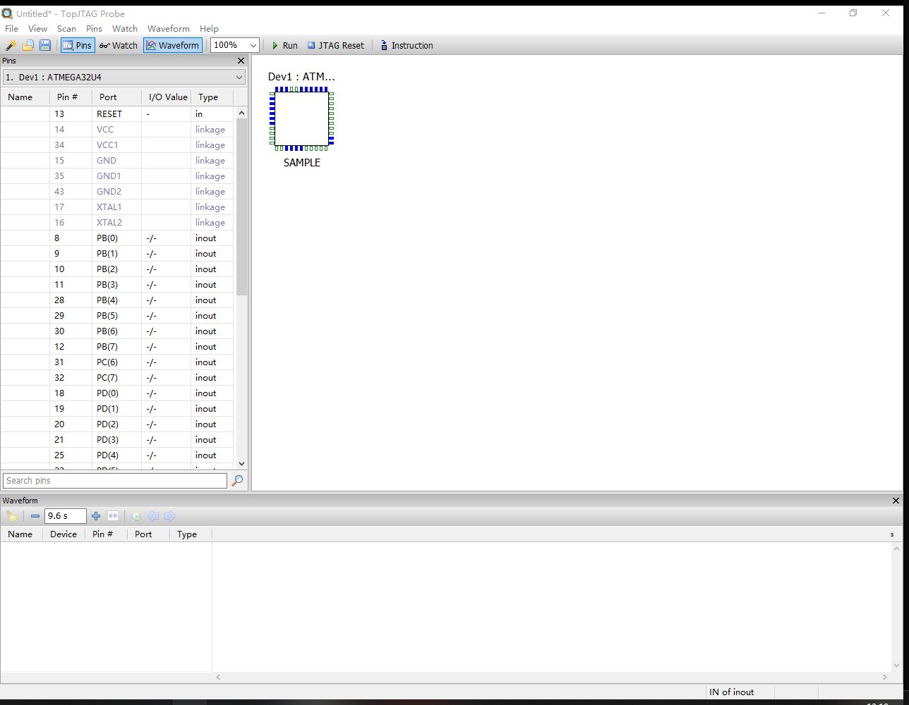
#### 6. JTAG 工作模式（Instruction）

| 模式 | 说明 |
|------|------|
| BYPASS | 芯片变为 1 位寄存器，用于跳过或测试 |
| SAMPLE | 不干扰设备操作，动态观察引脚（只读） |
| EXTEST | 控制输出、观察输入，测试外围电路 |
| INTEST | 测试芯片内部逻辑（部分芯片支持） |
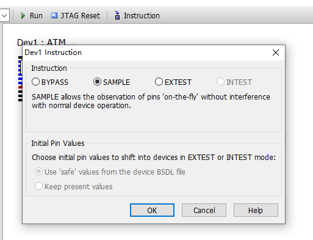
> 要修改输出，选择 **EXTEST**；仅观察电平选 **SAMPLE**。

#### 7. 引脚操作（右键菜单）

- 重命名
- 在封装图上显示
- 添加到监视窗口
- 添加到波形区
- 设置输出为 0 / 1 / 高阻态（EXTEST 模式）
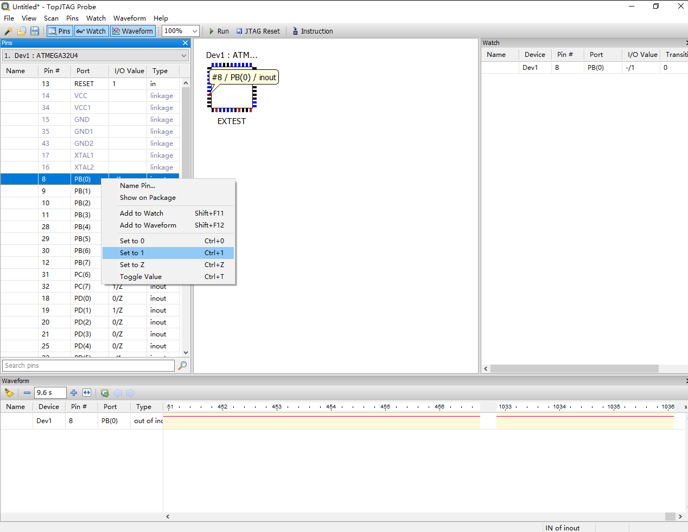

---

## 七、Linux 下的 urjtag

### 安装

```bash
sudo apt install urjtag
```

### 连接 Tigard

```bash
lsusb
# 应有输出：ID 0403:6010 Future Technology Devices International, Ltd FT2232C/D/H Dual UART/FIFO IC
```

打开 urjtag：

```bash
jtag
```
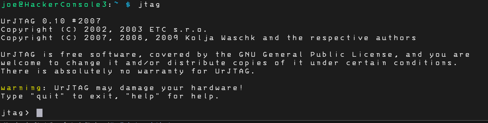
### 配置

```bash
cable ft2232 vid=0x0403 pid=0x6010 interface=1   # interface=1 对应 BDBUS
frequency 10000000                                 # 10M
detect                                            # 检测设备
```
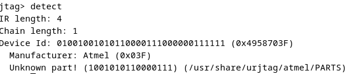
### 遇到的问题

示例使用 ATmega32u4（Arduino Leonardo），该芯片不在 urjtag 器件库中，但 ID 可检测到。

后续指令（如 `initbus ejtag`、`detectflash`、`readmem`、`writemem`）因 urjtag 缺乏维护，在现代 Linux 系统上存在兼容性问题。在 Ubuntu、Kali、Raspbian、Debian 上测试均遇到相同报错。

> 换用老内核 Linux 可能解决，但建议使用其他工具。

---

## 八、烧录 SPI Flash / EEPROM

Tigard 板载 **2×4 排针**，专为 SPI Flash 和 EEPROM 设计。

### SPI Flash 烧录（推荐使用 flashrom）

#### Windows 准备

1. 下载 flashrom（含 zadig.exe）
2. 打开 zadig.exe → Options → List all devices
3. 选择 **Tigard (Interface 1)** → Install Driver
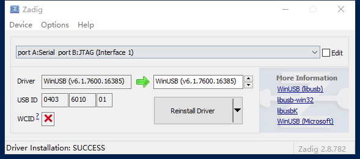

#### 常用命令

```powershell
# 查看帮助
.\flashrom.exe -help

# 读取
.\flashrom.exe -p ft2232_spi:type=2232H,port=B,divisor=4 -r flash.bin

# 写入
.\flashrom.exe -p ft2232_spi:type=2232H,port=B,divisor=4 -w flash.bin
```
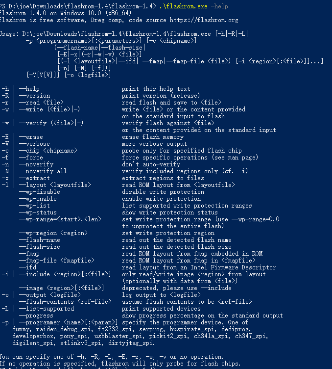
#### Linux 下使用

```bash
sudo apt install flashrom
flashrom -p ft2232_spi:type=2232H,port=B,divisor=4 -r flash.bin
```

> **参数说明**：`divisor` 为分频值，`0` 速度最高，`4` 为官方推荐。部分 SPI Flash 不支持过高速度，建议从高到低依次尝试。

### EEPROM 烧录（I2C）

> ⚠️ 官方说明：FT2232 对 EEPROM 支持性一般，但“姑且能用”。

#### 硬件连接

- 芯片第一脚附近有圆点，夹子灰排线的红线对应第一脚
- 红线靠近 JTAG 排针插入

#### 软件准备

```bash
pip install pyftdi
```
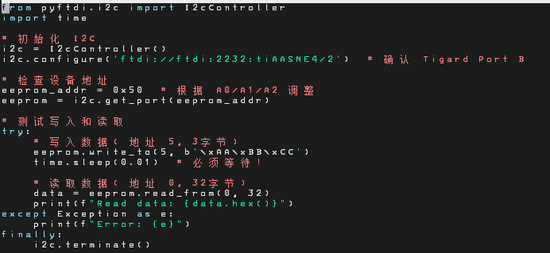
#### 示例代码（24LC512）

```python
# 完整代码随附，文件名：24lc512.py
```

#### 运行结果

成功写入并读出一段数据。


#### I2C 地址计算

EEPROM 的地址由地址引脚（A0、A1、A2）的电平决定。需查阅芯片数据手册，测量实际电平后计算 I2C 地址。
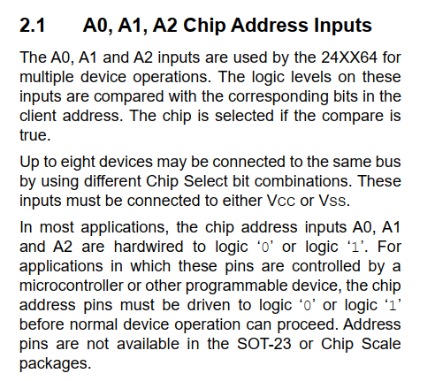
---

## 九、烧录 AVR 单片机

以 **Arduino Leonardo**（主控 ATmega32u4）为例。

### ISP 接口对应关系

| ISP | Tigard |
|-----|--------|
| SCK | TCK |
| MOSI | TDI |
| MISO | TDO |
| RST | SRST（⚠️ 注意：不能接到 TRST） |

![AVR(image/image30.png)

### 供电方式

- 推荐：USB 线单独给 Arduino 供电
- 备选：VTGT 开关拨到 5V，直接给 Arduino 供电（需接 GND）
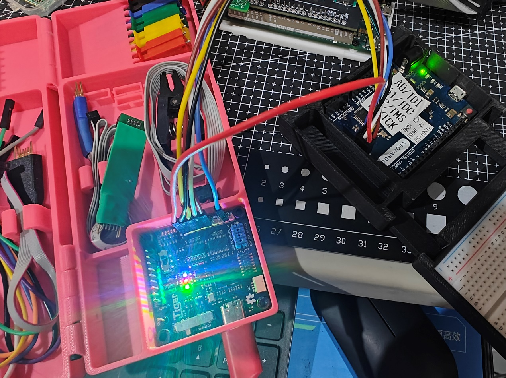

### Windows 软件

使用配套软件（随附安装包）：
- 编程器选择 **Tigard**
- 无需选择端口
- 驱动使用默认驱动即可
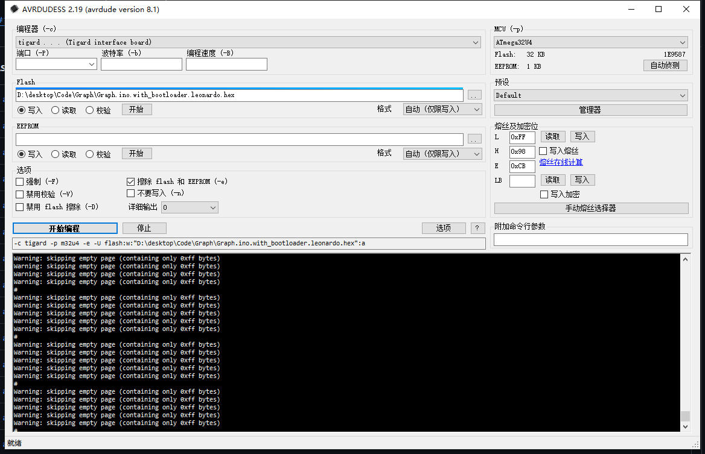
---

## 总结

Tigard 是一款功能强大、兼容性极佳的调试器，基于 FT2232 芯片设计，可满足从日常调试到逆向工程的多种需求。掌握其原理，你将能灵活应对各种芯片调试场景。