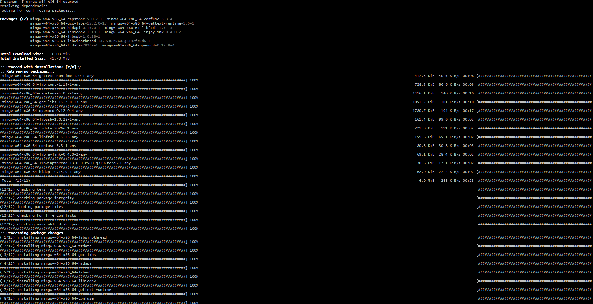
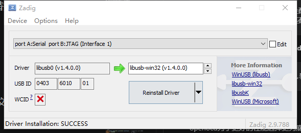
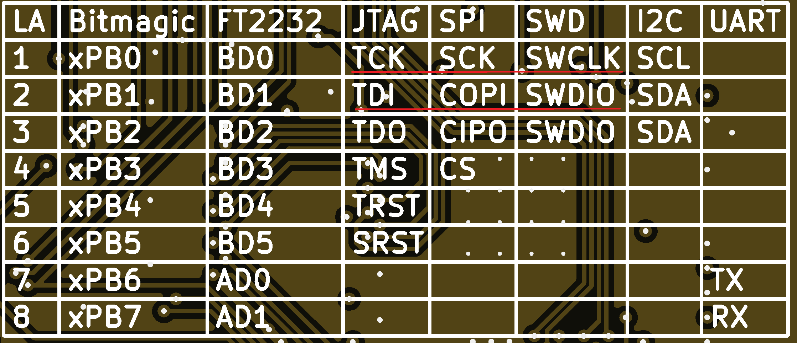
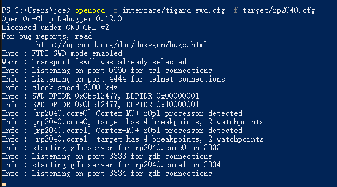

# Tigard 使用手册

## 简介

本分支为Tigard添加了中文的**说明书**，以及部分**软件**和**脚本**。

Tigard 是一款基于 **FT2232 芯片** 的多功能调试器，具备以下特点：

- 支持多种通讯方式：**串口、JTAG、SPI、I2C、SWD** 等
- 兼容多种电平标准：**1.8V、3.3V、5V** 以及待检测设备自身的通讯电平
- 适用场景：调试器、串口工具、逆向工程、芯片调试

> **官方资源**  
> GitHub: [https://github.com/tigard-tools/tigard](https://github.com/tigard-tools/tigard)  
> 视频教程: [Bilibili](https://www.bilibili.com/video/BV11A37zeEAP)

---

## 一、理解 FT2232 芯片

要真正理解 Tigard 的工作原理，必须先了解 **FT2232** 芯片。掌握了它，你就能理解市面上大部分烧录器的工作原理。

### FT 系列芯片命名规律

| 芯片 | 含义 |
|------|------|
| FT232 | 1 个串口（232 代表 RS232 标准） |
| FT2232 | 2 组串口 |
| FT4232 | 4 组串口 |

### 工作原理

- FT2232 相当于一个**不可编程的单片机**
- 启动时会检查外部 EEPROM，读取配置并按照配置工作
- FT2232 带有两组总线：**ADBUS** 和 **BDBUS**，功能完全相同
- 通过配置，可将总线设为不同接口：串口、JTAG 等
- **短接 TDI 和 TDO** 即可得到 SWD 接口


### 优势

将 ADBUS 设为**串口**、BDBUS 设为 **JTAG**，即可获得一套完善的调试方案：
- 串口用于接收日志
- JTAG 用于烧录和调试
---

## 二、Tigard 硬件设计

### 电平转换

FT2232 仅支持 **3.3V** 外部电压。为保证兼容性并保护芯片，Tigard 使用了 **74HC245 电平转换芯片**，通过开关控制转换侧电压，以适配不同设备。
需要注意的是开关上的 VTGT 档，其他几个档位是Tigard设置电平转换ic的同时，在 VTGT 引脚上输出对应设置的电压，相当于可以外供电，VTGT 档位会直接使用 VTGT 引脚上的电压给电平转换芯片供电，千万小心，过流和电压不同都有可能烧掉你的tigard或者调试板。


### 模式切换开关

板载开关用于在 **SWD / JTAG** 之间切换，同时也影响 I2C 和 SPI。其原理是短接 BDBUS1 和 BDBUS2。
MODE开关不影响串口的使用，但是如果一直连不上 swd 或者 jtag 接口上面的设备，最好是检查下这个开关是否在正确的档位。


### JTAG 与 SPI 的相似性

| JTAG | SPI | 方向 |
|------|-----|------|
| TDO | MOSI | 输出 |
| TDI | MISO | 输入 |
| TCK | SCK | 时钟 |
| TMS | CS | 输出 |

> 有趣的是：JTAG 和 SPI 都是 **输入量 = 输出量** 的协议。JTAG 可以看作是 SPI 的一种变体，核心区别在于增加了状态机。

### SWD 模拟

- SWD-SWCLK → JTAG-TCK（时钟）
- SWD-SWDIO（双向） → JTAG-TDO（输出） + JTAG-TDI（输入）
- 把MODE开关打到SWD档即可短接JTAG-TDO + JTAG-TDI

### I2C 模拟

| I2C | SWD |
|-----|-----|
| SDA | SWDIO |
| SCL | SWCLK |

> ⚠️ 注意：I2C 引脚是**开漏**结构，需要上拉电阻；SWD 不需要。两者仅在“形式上”相似，协议差异很大。

---

## 三、连接电脑

将 Tigard 接入电脑后，设备管理器中会出现 **三个新增设备**：

| 设备 | 说明 |
|------|------|
| USB Serial Port | 标准串口（含 DCD、DSR、DTR、CTS、RTS） |
| USB Serial Converter A | 与上述串口本质相同，但是会被分配串口号 |
| USB Serial Converter B | JTAG 接口（此接口是被设置为MPSSE模式，不会被分配串口号） |
---

## 四、串口功能

Tigard 的串口引出为 **9-pin 接口**，包含 DTR 等信号（廉价工具常省略）。DTR 常被用作单片机复位信号。

- **最高波特率**：12 Mbit
- **优点**：免驱、误码率低

**串口定义**


---

## 五、接口兼容性

FT2232 的 JTAG 接口久经考验。Tigard 的 JTAG 兼容性极佳，已成功连接：

- FPGA
- AVR 单片机
- 博通芯片

**JTAG接口定义**


> 基本上，该接口对任意 JTAG 设备都管用。

FT2232 的 SWD 接口也不遑多让，已经在 stm32 以及树莓派 pico 上进行测试，同样成功。

---

## 六、Top JTAG Probe（TJP）使用教程

> 这是一款 **JTAG 逆向软件**，官网：[http://www.topjtag.com/probe/](http://www.topjtag.com/probe/)  
> 非免费，但有试用期。JTAG 最初用于边界扫描，后续扩展出烧录等功能，该软件利用 JTAG 的边界扫描功能，直接读取芯片内部寄存器状态。


### 示例硬件

使用 **Arduino Leonardo**，通过 USBasp 烧录器修改熔丝位，开启 JTAG 接口。


> ⚠️ 注意：AVR 的 JTAG 接口在 ADC 引脚上，开启后 ADC 功能不可用。

### 操作步骤

#### 1. 新建项目


#### 2. 配置参数

| 参数 | 设置 |
|------|------|
| Connection | Generic FTDI FT2232 |
| Device | 选靠下的选项（A 口为串口，B 口为 JTAG） |
| Static Pins | **Olimex ARM-USB-OCD** |
| JTAG 速度 | 从低到高测试，最高 30M |


#### 3. 识别芯片

点击 Next，若能正常识别，可返回上一步提高速度。

示例识别结果：Atmel 芯片，ID CODE = `4958703Fh`


#### 4. 加载 BSDL 文件

- 推荐下载网站：[https://www.bsdl.info/index.htm](https://www.bsdl.info/index.htm)
- 根据 ID CODE 搜索并下载对应 BSDL 文件
- 点击 **BDSL File** 导入，再按实际封装设置 Package


> BSDL = Boundary Scan Description Language，描述芯片封装、引脚定义及 JTAG 可用寄存器。

#### 5. 软件界面布局

- 左侧：芯片 IO 列表
- 右侧：芯片封装图
- 底部：引脚波形区

#### 6. JTAG 工作模式（Instruction）

| 模式 | 说明 |
|------|------|
| BYPASS | 芯片变为 1 位寄存器，用于跳过或测试 |
| SAMPLE | 不干扰设备操作，动态观察引脚（只读） |
| EXTEST | 控制输出、观察输入，测试外围电路 |
| INTEST | 测试芯片内部逻辑（部分芯片支持） |


> 要修改输出，选择 **EXTEST**；仅观察电平选 **SAMPLE**。

#### 7. 引脚操作（右键菜单）

- 重命名
- 在封装图上显示
- 添加到监视窗口
- 添加到波形区
- 设置输出为 0 / 1 / 高阻态（EXTEST 模式）


---

## 七、openocd的使用

### openocd简介

OpenOCD (Open On-Chip Debugger) 是一个开源的调试器软件，支持多种调试器和目标芯片


### openocd的安装

请下载最新的 MSYS2 ，或者是使用本项目中**\tigard配套工具\openocd相关文件**下的“ msys2-用于安装openocd.exe ”，安装该软件。
安装完成会显示一个命令行界面，输入指令：

```bash
pacman -S mingw-w64-x86_64-openocd
```
会有如下输出

安装完成后输入以下指令查看 openocd 的位置
```bash
find /ucrt64 -name "openocd.exe" 2>/dev/null
find /mingw64 -name "openocd.exe" 2>/dev/null
```
输出如下
```bash
/mingw64/bin/openocd.exe
```
打开 MSYS 的安装文件夹，进而寻找上面这个目录，将整个目录复制下来，比如我复制下来就是
**D:\program\msys2\mingw64\bin**
将该目录添加至环境变量
1. 右键点击 **"此电脑"** → **"属性"** → **"高级系统设置"** → **"环境变量"**
2. 在 **"系统变量"** 或 **"用户变量"** 中找到 `Path`，选中后点击 **"编辑"**
3. 点击 **"新建"**，添加 OpenOCD 所在目录，**D:\program\msys2\mingw64\bin**，此处应替换为你的目录位置
4. 依次点击 **"确定"** 保存

在**msys2\mingw64**文件夹下，有两个文件夹需要注意：

**\msys2\mingw64\share\openocd\scripts\interface**

	该文件夹用于存储烧录器的相关配置文件，请将本项目下的**tigard配套工具\openocd相关文件**中的三个配置文件放置于以上的文件夹中，会覆盖掉原来的一个 tigard.cfg ，我提供的版本是去掉了对设备ID的匹配，也可以兼容其他ID的Tigard
	
**\msys2\mingw64\share\openocd\scripts\target**

	被调试的芯片的 cfg 文件都在这，新添加的芯片的配置文件请添加至此处，其中也包含了大量的 ic ，可以做参考
	
### 打个驱动

openocd为了更好的性能选择更为底层的驱动程序，也就是 libusb 或者 Winusb ，而非默认的 FTDI 提供的 VCP 程序
在配套工具文件夹下，我提供了 Zadig，一个给这类设备更换驱动的小软件，按照下面步骤来吧
1. 以管理员身份运行 zadig.exe
2. 在菜单栏点击 Options -> List All Devices
3. 在下拉列表中，找到 Tigard 设备。它可能会显示为 Tigard (Interface 1)、USB Serial Converter A 或类似的名字，通常有不止一个选项，需要逐个检查
    > 小技巧：你可以**插拔**一下设备，看列表中哪个设备会随之出现或消失，那就是它了
4. 选中尾缀为**interface1**的设备后，看右边的绿色箭头。把目标驱动设置为 WinUSB (或者 libusb / libusbK)
5. 点击 "Replace Driver" 按钮，等待操作完成


	
### 硬件连接

在这里使用 Tigard 搭配树莓派 pico 来进行测试， pico 是 SWD 接口，我们要做少量调整
1. 将 Tigard 的 Mode 开关调整至SWD模式
2. 将 Tigard 的电压开关调整至3.3V
3. 接线请参考板子背面的表格，连接 SWCLK 以及 SWDIO ，而且不要忘记共地



4. 使用数据线单独链接 Tigard 和树莓派 pico 

### 使用openocd

使用如下指令：
```bash
openocd -f interface/tigard-swd.cfg -f target/rp2040.cfg
```
成功识别如下图



openocd 类似一个底层驱动将会一直运行，如何连接和调用请参考**tigard配套工具\openocd相关文件\《OpenOCD与JTAG调试详解》**下的相关文件

---

## 八、Linux 下的 urjtag

### 安装

```bash
sudo apt install urjtag
```

### 连接 Tigard

```bash
lsusb
# 应有输出：ID 0403:6010 Future Technology Devices International, Ltd FT2232C/D/H Dual UART/FIFO IC
```

打开 urjtag：

```bash
jtag
```

### 配置

```bash
cable ft2232 vid=0x0403 pid=0x6010 interface=1   # interface=1 对应 BDBUS
frequency 10000000                                 # 10M
detect                                            # 检测设备
```

### 遇到的问题

示例使用 ATmega32u4（Arduino Leonardo），该芯片不在 urjtag 器件库中，但 ID 可检测到。

后续指令（如 `initbus ejtag`、`detectflash`、`readmem`、`writemem`）因 urjtag 缺乏维护，目前默认的安装包是2007年的版本，在现代 Linux 系统上存在兼容性问题。在 Ubuntu、Kali、Raspbian、Debian 上测试均遇到相同报错。
在自行编译最新版本的 urjtag（2021.03版本）之后，这些问题仍然存在，所以建议使用其他软件，比如openocd

> 换用老内核 Linux 可能解决，但建议使用其他工具。

---

## 九、烧录 SPI Flash / EEPROM

Tigard 板载 **2×4 排针**，专为 SPI Flash 和 EEPROM 设计，引脚正对应各种8脚格式的存储IC。
**SPI Flash的引脚定义**


**EEPROM的引脚定义**（同组排针，丝印在**底部**）


### SPI Flash 烧录（推荐使用 flashrom）

#### Windows 准备

1. 打开随附的 flashrom（也含 zadig.exe）
2. 打开 zadig.exe → Options → List all devices
3. 选择 **Tigard (Interface 1)** → Install Driver


#### 常用命令

以下使用的是Power shell来运行
```powershell
# 查看帮助
.\flashrom.exe -help

# 读取
.\flashrom.exe -p ft2232_spi:type=2232H,port=B,divisor=4 -r flash.bin

# 写入
.\flashrom.exe -p ft2232_spi:type=2232H,port=B,divisor=4 -w flash.bin
```

#### Linux 下使用

```bash
sudo apt install flashrom #安装flashrom
flashrom -p ft2232_spi:type=2232H,port=B,divisor=4 -r flash.bin #烧录flash.bin文件
```

> **参数说明**：`divisor` 为分频值，`0` 速度最高，`4` 为官方推荐。部分 SPI Flash 不支持过高速度，建议从高到低依次尝试。

### EEPROM 烧录（I2C）

> ⚠️ 官方说明：FT2232 对 EEPROM 支持性一般，但“姑且能用”。

#### 硬件连接

- 芯片第一脚附近有圆点，夹子灰排线的红线对应第一脚
- 红线靠近 JTAG 排针插入

#### 软件准备

```bash
pip install pyftdi
```

#### 示例代码（24LC512）

```python
# 完整代码随附，文件名：24lc512.py
```

#### 运行结果

成功写入并读出一段数据。


#### I2C 地址计算

EEPROM 的地址由地址引脚（A0、A1、A2）的电平决定。需查阅芯片数据手册，测量实际电平后计算 I2C 地址。
>  以 24LC512 为例，A0/A1/A2 接地时地址为 0x50


---

## 十、烧录 AVR 单片机

以 **Arduino Leonardo**（主控 ATmega32u4）为例。

### ISP 接口对应关系

| ISP | Tigard |
|-----|--------|
| SCK | TCK |
| MOSI | TDI |
| MISO | TDO |
| RST | **SRST**（⚠️ 注意：不能接到 **TRST**） |


### 供电方式

- 推荐：USB 线单独给 Arduino 供电
- 备选：VTGT 开关拨到 5V，直接给 Arduino 供电（需接 GND）


### Windows 软件

使用配套软件AVRDESS（随附安装包）：
- 编程器选择 **Tigard**
- 无需选择端口
- 驱动使用默认驱动即可

---

## 十一、小Hack

板子背面有两个没有贴任何东西的0805焊盘
- ISO焊盘，默认中间有走线短接，用刀切断之后，排针就不再向外供电了，正面电压开关自此只做参考电压为电平转换芯片供电

- Hack焊盘，默认不连接，MODE开关打到SWD模式时，默认TDO和TDI引脚之间有一个33欧姆的电阻，短接该焊盘即可短接这个电阻，SWD接口通讯不正常时可以测试下短接

---

## 其他的接口

### Cortex Debug (10针) 接口


该Cortex Debug 10针连接器同时支持JTAG和Serial Wire信号。对于基于Cortex-M处理器的设备，您可以将调试器配置为JTAG或Serial Wire（SWD）模式
以下内容来自ARM的文档

#### 10针引脚分配图


##### JTAG 信号

| 信号 | 连接说明 |
| :--- | :--- |
| **TMS** | 测试模式状态引脚 — 使用100K欧姆上拉电阻连接至VCC |
| **TDO** | 测试数据输出引脚 |
| **TDI** | 测试数据输入引脚 — 使用100K欧姆上拉电阻连接至VCC |
| **TCLK** | 测试时钟引脚 — 使用100K欧姆下拉电阻连接至GND |
| **VCC** | 正电源电压 — JTAG接口驱动器的电源 |
| **GND** | 数字地 |
| **nRESET** | 复位引脚 — 将此引脚连接到目标CPU的（低电平有效）复位输入端。使用100K欧姆上拉电阻连接至VCC。此为开集电极/开漏输出 |

##### SWD 信号

SWD模式是JTAG端口的一种不同工作模式，仅使用两个引脚进行通信。可选择使用第三个引脚来跟踪数据。JTAG引脚与SW引脚是共享的

- **TCLK** 即 **SWCLK** (串行线时钟)
- **TMS** 即 **SWDIO** (串行线调试数据输入/输出)
- **TDO** 即 **SWO** (串行线跟踪输出)

| 信号 | 连接说明 |
| :--- | :--- |
| **SWDIO** | 数据输入/输出引脚。使用100K欧姆上拉电阻连接至VCC |
| **SWO** | 可选跟踪输出引脚 |
| **SWCLK** | 时钟引脚。使用100K欧姆下拉电阻连接至GND |
| **VCC** | 正电源电压 — JTAG接口驱动器的电源 |
| **GND** | 数字地 |
| **nRESET** | 复位引脚 — 将此引脚连接到目标CPU的（低电平有效）复位输入端。使用100K欧姆上拉电阻连接至VCC。此为开集电极/开漏输出 |

### LA接口和IIC接口


### LA接口

LA接口直接和FT2232接触，用于连接逻辑分析仪来分析FT2232和外部的通讯，可以用于测试tigard的好坏或者分析串口和JTAG通讯

### IIC接口

IIC接口使用SH1.0的线来进行连接，线序定义从上图，左至右依次是，GND/VCC/SDA/SCL

---

## 总结

Tigard 是一款功能强大、兼容性极佳的调试器，基于 FT2232 芯片设计，可满足从日常调试到逆向工程的多种需求。掌握其原理，你将能灵活应对各种芯片调试场景。